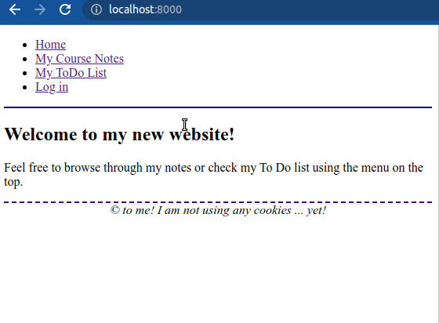
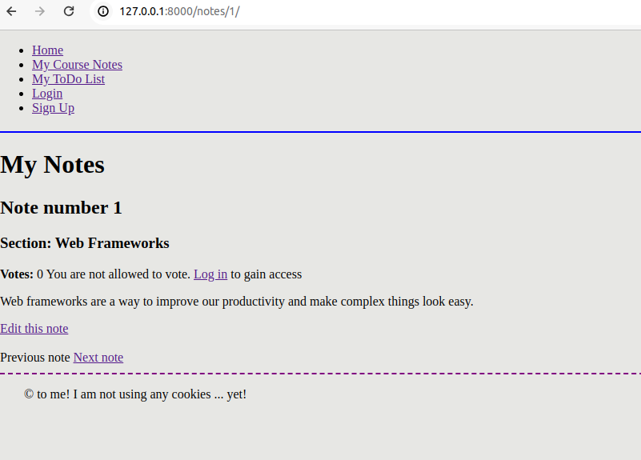
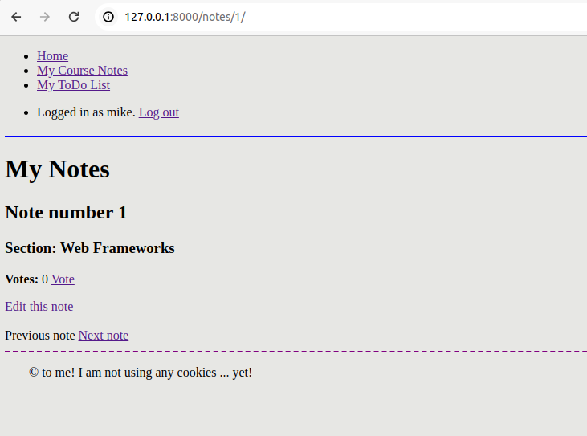
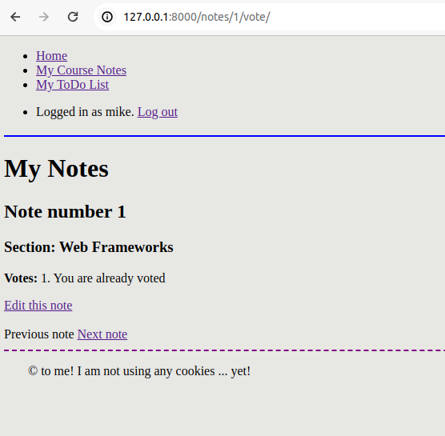
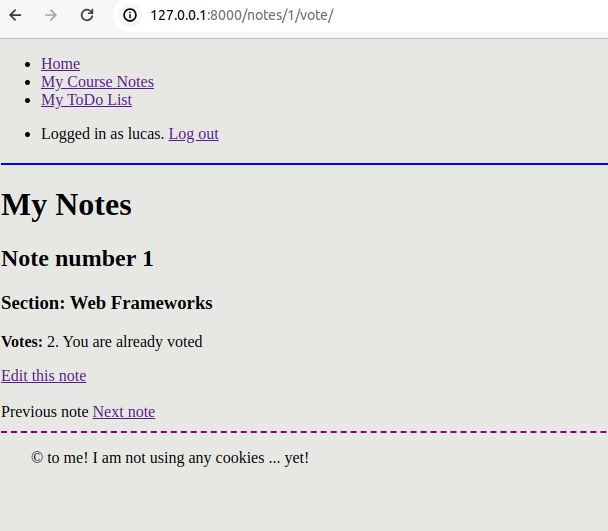
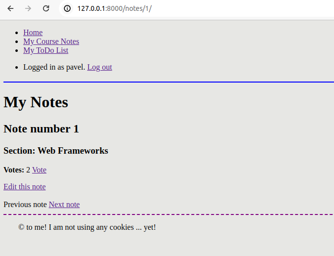

# Django-sessions-mkskh Exercise-Project 

## This is a continuation of previous projects:
[Django-forms](https://github.com/mkskh/Django-forms-mkskh) 
[Django_views-and-templates](https://github.com/mkskh/Django_views-and-templates-mkskh/tree/main) 

## Consists of 3 tasks:

### task1

### task2

### task3
Vote system:

-if you are not logged in

-you are logged in (first user - mike)

-after clicking "Vote"

-you are logged in (second user - lucas) and see it after clicking "Vote"

-you are logged in (third user - pavel) and see it before clicking "Vote"

